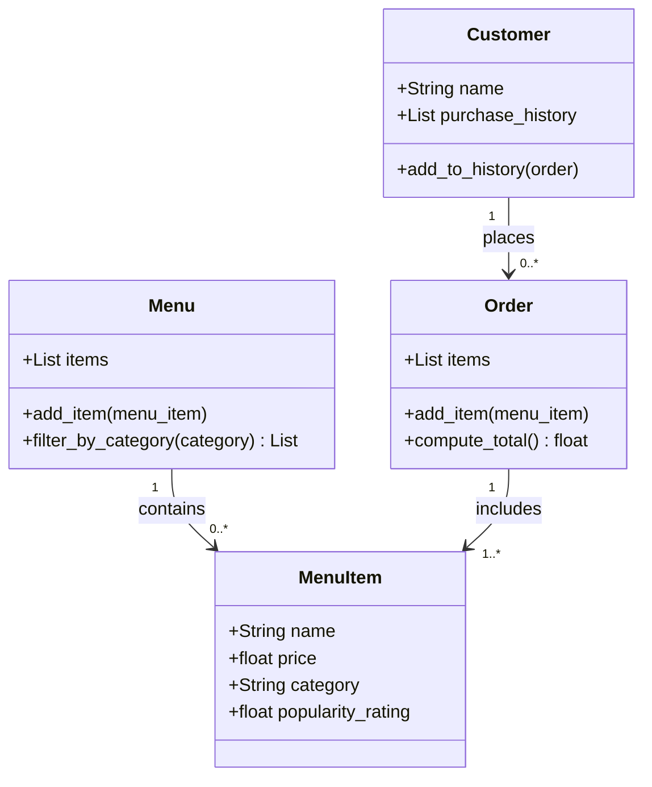

# ByteBites Final UML Design

```mermaid
classDiagram
    class Customer {
        +String name
        +List purchase_history
        +add_to_history(order)
    }

    class MenuItem {
        +String name
        +float price
        +String category
        +float popularity_rating
    }

    class Menu {
        +List items
        +add_item(menu_item)
        +filter_by_category(category) List
    }

    class Order {
        +List items
        +add_item(menu_item)
        +compute_total() float
    }

    Customer "1" --> "0..*" Order : places
    Menu "1" --> "0..*" MenuItem : contains
    Order "1" --> "1..*" MenuItem : includes
```