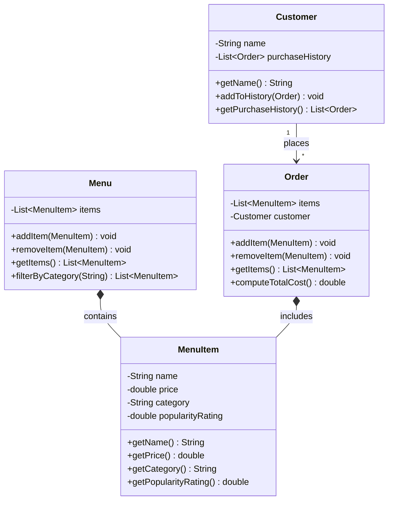

# Draft UML Diagram from Claude

```mermaid
classDiagram
    class Customer {
        -String name
        -List~Order~ purchaseHistory
        +getName() String
        +addToHistory(Order) void
        +getPurchaseHistory() List~Order~
    }

    class MenuItem {
        -String name
        -double price
        -String category
        -double popularityRating
        +getName() String
        +getPrice() double
        +getCategory() String
        +getPopularityRating() double
    }

    class Menu {
        -List~MenuItem~ items
        +addItem(MenuItem) void
        +removeItem(MenuItem) void
        +getItems() List~MenuItem~
        +filterByCategory(String) List~MenuItem~
    }

    class Order {
        -List~MenuItem~ items
        -Customer customer
        +addItem(MenuItem) void
        +removeItem(MenuItem) void
        +getItems() List~MenuItem~
        +computeTotalCost() double
    }

    Menu *-- MenuItem : contains
    Customer "1" --> "*" Order : places
    Order *-- MenuItem : includes
```